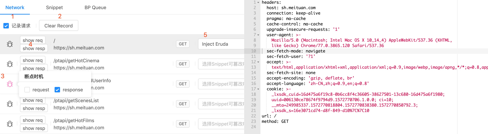
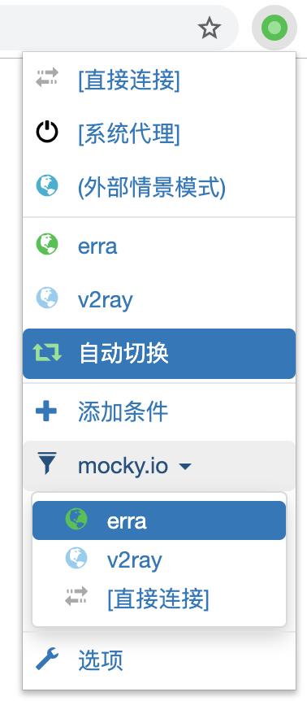
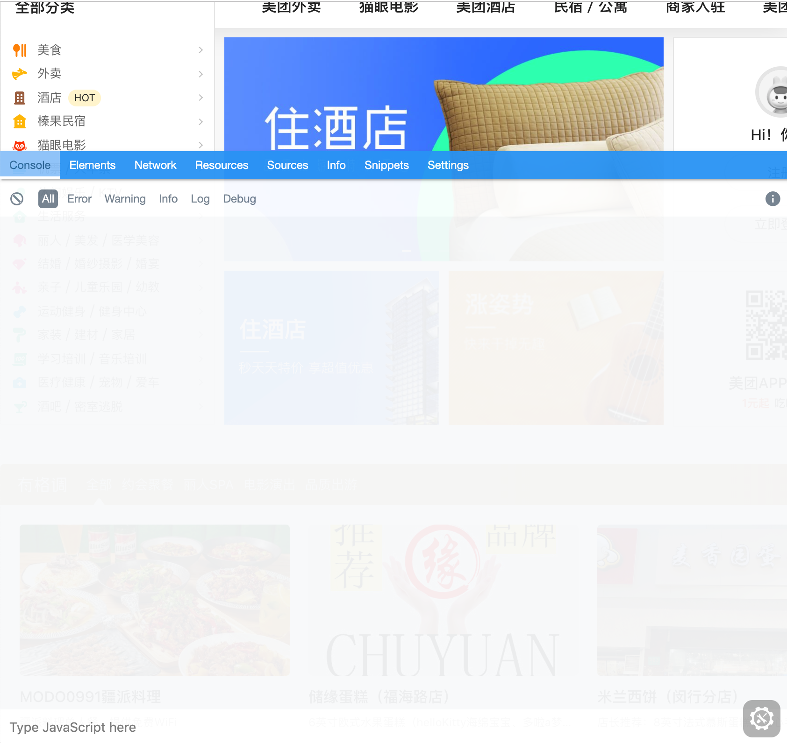
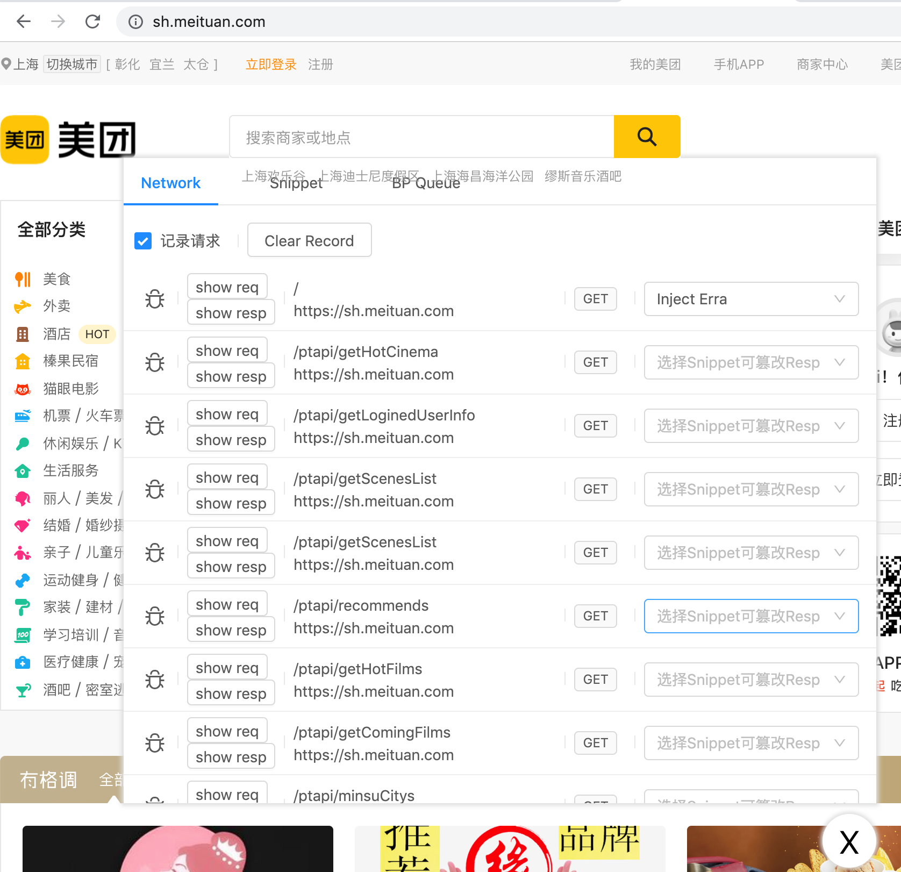

# 使用指南

## 概览
> Erra由一个http(s)代理服务加UI界面组成，用户通过界面控制代理服务器的行为来实现各种功能。  
> 详情请参阅[设计文档](./design.md)

### UI界面

Erra界面由三个Tab页组成：  
1. Network：记录所有经过代理服务器的Http请求。  
1. Snippet：编写、管理Snippet。  
1. BP Queue：命中断点的请求会产生一个断点消息天到队列中，由用户进行处理。  

## 请求列表
如图，在列表页你可以
1. 控制是否需要记录代理服务器的请求  
1. 清理列表内容  
1. 设置断点  
1. 查看请求的Request、Response（只读）  
1. 给请求快速绑定Snippet，后续请求数据会被Snippet修改  


## 断点编辑
给请求添加断点后，后续相同请求触发时会在BP Queue页面产生一条记录。  
此时你可以编辑请求的内容，点击“完成”按钮后，请求才会进行下一步（发送到远程服务器或者被浏览器接收）。  
此外你还可以选择跳过、中断当前请求；开关断点功能、跳过所有断点消息；勾选“自动开始下一个”表示处理完当前消息会马上激活下一条消息。  


## 使用Snippet
到这里，我们已经拥有了随意编辑Http请求的能力，但是断点编辑的效率很低。  
开发调式阶段，同一个请求很可能会被发起多次，如果每次请求都需要断点编辑，这是无法忍受的。接口绑定Snippet后，后续该接口的数据会自动被Snippet修改。  

:::tip
如果不理解Snippet的含义可以参阅[Snippet解释](./design.md#Snippet解释)，Snippet字段含义参阅[配置说明](./config-desc.md#snippet)。  
*若你还没有安装SwitchyOmega插件、信任证书，请参阅[代理配置](./start.md#代理配置)、[信任证书](./trust-ca.md)*
:::

### 接口绑定Snippet
1. 使用Chrome访问[mocky test api](https://www.mocky.io/v2/5185415ba171ea3a00704eed)可以得到返回值：
```json
{
  "hello": "world"
}
```
2. 使用SwitchyOmega插件将当前域名的请求使用Erra代理。  


3. 刷新[mocky test api](https://www.mocky.io/v2/5185415ba171ea3a00704eed)页面，在Erra Network页可以看到mocky的请求记录，并将其绑定到Simple-Demo。  


4. 刷新[mocky test api](https://www.mocky.io/v2/5185415ba171ea3a00704eed)页面，此时收到的返回值应为：  
```json 
{
  "hello": "Erra!"
}
```

## 编写Snippet
Erra初始时创建了几个Snippet Demo，你可以参考Demo学习简单用法。  
可以尝试点击Snippet标签页下的“新增Snippet”按钮


### 修改返回值

使用Snippet自动修改http内容，需要对http数据结构有些许了解。Erra将http结构简化为：    
```ts
interface SimpleReq {
  url: string,
  method: HttpMethod,
  headers: StrObj,
  body?: any,
}

interface SimpleResp {
  statusCode: number,
  headers: StrObj,
  body?: any,
}
```
以最简单的自动[修改返回值](./guide.md#修改返回值)为例，将Http Response body内容`{ hello: 'world!' }`修改为`{ hello: Erra! }`。  
Http Response对应的数据结构为：  
```js
{
  statusCode: 200,
  headers: {/*...*/},
  body: {
    hello: 'world!'
  }
}
```
`Simple-Demo`对应的Snippet配置如下：  
```yaml
id: 6353c69c-e1e6-4b34-a61a-c44271fce483
name: Simple-Demo
content:
  body:
    hello: Erra!
```
我们可以看到，修改（或者说“覆盖”）Http请求中的某个值，只需要`content`内容的层级结构与之保持一致即可，不需要修改的字段（statusCode、headers）可以省略。  

### 集成mockjs，生成随机数
Snippet集成了Mockjs，用来快速生成mock数据。参考Erra自带的Snippet：`Mockjs-Random`  
```yaml
name: Mockjs-Random
content:
  body:
    # key的前缀`$mockjs `表示这个字段将被mockjs解析。
    # 根据mockjs语法，hello的值将是一个随机字符串。
    $mockjs hello: '@str'
```
参考[修改返回值](./guide.md#修改返回值)第三步，将mocky请求绑定到`Mockjs-Random`，再刷新[mocky test api](https://www.mocky.io/v2/5185415ba171ea3a00704eed)页面，可以看到`hello`的值变成了随机字符串，可以再尝试刷新几次观察返回值。  
这是一个返回示例：  
```json 
{
  "hello": "IZUsd"
}
```

### 代理转发请求
代理转发请求实际上就是修改Http请求中的`headers.host`和`url`两个字段，参考Erra自带的Snippet：`Forward-Meituan`。  
```yaml 
name: Forward-Meituan
when: !<tag:yaml.org,2002:js/regexp> /meituan.com/
content:
  headers:
    host: www.mocky.io
  url: !<tag:yaml.org,2002:js/function> |-
    function anonymous(
    ) {

    return '/v2/5185415ba171ea3a00704eed'

    }
```
::: tip
yaml的函数、正则支持参考[js-yaml](https://github.com/nodeca/js-yaml)，*上面代码中函数样式是js-yaml解析后的，看起来不是很舒服，是后续需要解决的问题*。  
这里需要介绍一下字段`when`，表示请求的url被正则匹配成功，当前Snippet即生效，不需要像在Network页手动页面绑定请求。  
:::

1. 勾选`Forward-Meituan`前面的Checkbox  
  
2. 访问[美团首页](https://sh.meituan.com)  
3. 参考前文配置使用Erra代理，刷新页面  
4. 可以看到美团首页返回了一个json `{ "hello": "world" }`  

### 注入Eruda
[Eruda](https://github.com/liriliri/eruda)是一款优秀的移动端Console工具，参考Erra自带的Snippet`Inject Eruda`，原理就是向html中插入Eruda的启动代码。  
```yaml 
name: Inject Eruda
content:
  headers:
    content-security-policy: ''
  body: !<tag:yaml.org,2002:js/function> |-
    function anonymous(body
    ) {
      return body.replace(/(<\/body>)/, '<script src="//cdn.bootcss.com/eruda/1.5.2/eruda.min.js"></script><script>eruda.init();</script>$1')
    }
```
1. 去掉`Forward-Meituan`的勾选状态
2. 访问[美团首页](https://sh.meituan.com)  
3. Network页给请求`https://sh.meituan.com/`绑定`Inject Eruda`  
4. 刷新美团首页  
  

### 注入Erra界面
将Erra UI注入到调试的网页，所有Erra操作可以在当前页面完成，不需要切换浏览器Tab了，提高效率和体验。当有新的断点消息需要处理时，入口图标会闪烁。  
注入方式与[注入Eruda](./guide.md#注入Eruda)的步骤一致。  
  

::: tip
注意第六行的script src，如果被注入的页面在其他设备上打开，此时两台设备必须在同一个局域网内，然后将**localhost改为当前设备的ipv4**（如192.168.1.4）
:::
```yaml {6}
name: Inject Erra
content:
  body: !<tag:yaml.org,2002:js/function> |-
    function anonymous(body
    ) {
      return body.replace(/(<\/body>)/, '<script src="https://localhost:4455/erra/erra-portal.js"></script>$1') 
    }
```

### Snippet引用
这是Snippet高级功能，mock数据复用的问题。参考Erra自带的Snippet`Include-Snippet`，`$snippet `前缀表示该字段的值交给另一个Snippet去修改。  
```yaml
name: Include-Snippet
content:
  body:
    code: 200
    $snippet include: Simple-Demo|6353c69c-e1e6-4b34-a61a-c44271fce483
```
Snippet名称后面的id不需要手动输入，输入名称第一个字母后编辑器会自动补全。  
  

将mocky请求绑定到`Include-Snippet`，刷新[mocky test api](https://www.mocky.io/v2/5185415ba171ea3a00704eed)，将得到返回值：  
```json 
{
  "hello": "world",
  "code": 200,
  "include": {
    "body": {
      "hello": "Erra!"
    }
  }
}
```
