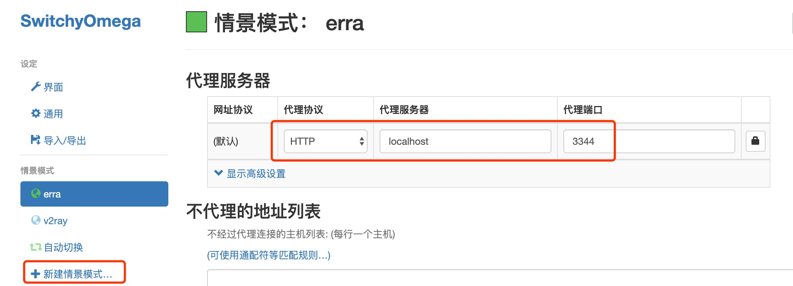
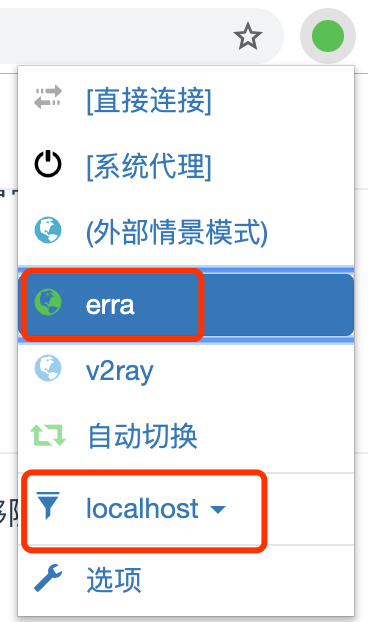

# 快速启动

## 安装Erra
1. 安装  
`yarn global add erra` 或 `npm i -g erra`  

2. 启动
```sh
erra start

# 配置文件路径： /Users/<home dir>/.erra/erra.config.yaml
# > erra@0.1.3 server:bin /Users/fenghen/.config/yarn/global/node_modules/erra
# > node ./dist/server/server/index.js -c "/Users/fenghen/.erra/erra.config.yaml"
# 本地代理服务已启动，http_proxy=http://192.168.1.4:3344
# erra管理界面地址，https://192.168.1.4:4455/erra
```

3. 自定义配置文件[可选步骤]  
```sh
# cd <your project directory>
erra create
# 配置文件创建成功：<your project directory>/erra.config.yaml
```
*这是一个可选步骤，在项目目录下执行该命令，将自定义配置提交到git，可以将增强的能力共享给团队其他同学。*  
配置文件内容说明请参阅[配置文件说明](./config-desc.md)

4. 访问[Erra管理页面](https://localhost:4455/erra)，此时浏览器会提示“您的连接不是私密连接”，可以暂时点击“高级”跳过。  

::: tip
若要消除浏览器的“不安全”警告、代理https请求，建议阅读并执行[信任证书](./trust-ca)
:::

## 代理配置
Erra的核心是一个http(s)代理服务器，请求数据经过代理服务器，我们才能够随意编辑它。  
1. 安装chrome代理设置插件 [SwitchyOmega](https://chrome.google.com/webstore/detail/proxy-switchyomega/padekgcemlokbadohgkifijomclgjgif?hl=en-US)  
2. 进入SwitchyOmega的配置页，新建情景模式  
3. 设置情景模式的代理协议为HTTP，代理服务器为`localhost`，端口默认为`3344`(若需修改参考[配置文件说明](./config-desc))  

4. 设置Erra为Chrome全局代理或指定某个域名  


-------

参阅[使用指南](./guide.md)了解更多Erra功能。  