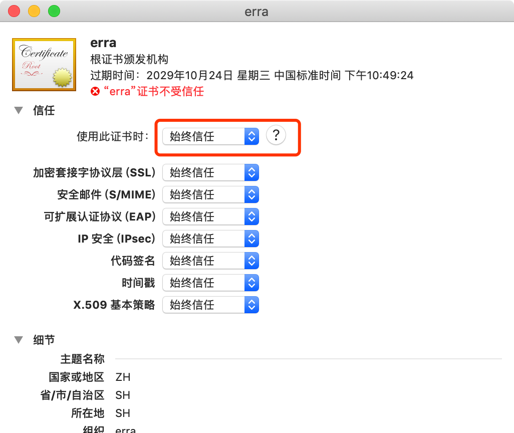

# 信任证书
https已经非常流行，代理（或篡改）https请求，必须信任一个Root证书。  
Erra默认Root证书、Key文件在`<home dir>/.erra`文件夹下。  

*若你对安全性比较敏感，可以使用openssl生成自己**Root证书**（非Root证书无法被新版安卓信任）和Key，并覆盖`<home dir>/.erra/erra.crt.pem`、`<home dir>/.erra/erra.key.pem`。*  

## Mac信任证书
1. 执行`open ~/.erra`，双击`erra.crt.pem`，输入用户密码，将证书添加到钥匙串  
2. 选择`系统 -> 证书`，双击`erra`，选择`始终信任`，关闭弹窗，输入用户密码确认  

3. **重启浏览器**访问Erra管理页面[https://localhost:4455/erra](https://localhost:4455/erra)，参阅[使用指南](./guide.md)了解更多功能。  

## iOS信任证书
1. 下载证书，Safari访问`https://<your ip>:4455/erra/erra.crt.pem`  
2. Safari打开证书链接后会自动下载、进入安装界面，按照提示进行操作。  
3. iOS 10.3以上的系统在安装根证书后，需要进入`Settings > General > About > Certificate Trust Testings`里面进行证书信任，新安装的根证书才生效。  

## Android信任证书
Android系统繁杂，请Google、Baidu如何安装证书。  

::: tip
- 安装证书成功后，一定要**重启浏览器**，否则浏览器仍然提示“不是私密连接”。  
- 有些Android手机安装证书时要求选择“VPN及应用”、“WALN”。请安装两次，分别选择两个类型。  
:::